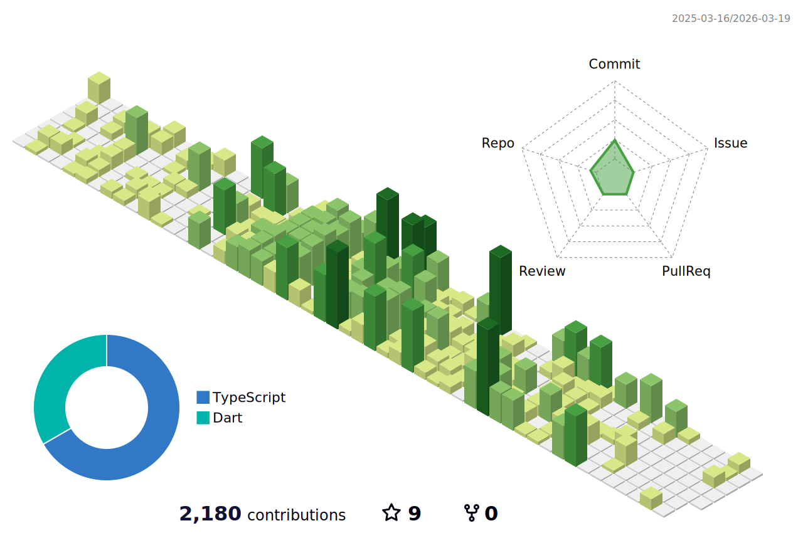

 
[U-22 プログラミング・コンテスト 2020](https://u22procon.com/2020/report/) 
 
<table>
  <tr>
    <td>閲覧者数</td>
    <td></td>
  </tr>
</table>

## 🌐 公式ホームページ
https://rabbitprogram.com/

## 🌱 スキル

## 📊 貢献ログ（毎日AM2:00に反映）

 

<!--
**RabbitProgram/RabbitProgram** is a ✨ _special_ ✨ repository because its `README.md` (this file) appears on your GitHub profile.

Here are some ideas to get you started:

- 🔭 I’m currently working on ...
- 🌱 I’m currently learning ...
- 👯 I’m looking to collaborate on ...
- 🤔 I’m looking for help with ...
- 💬 Ask me about ...
- 📫 How to reach me: ...
- 😄 Pronouns: ...
- ⚡ Fun fact: ...
-->
